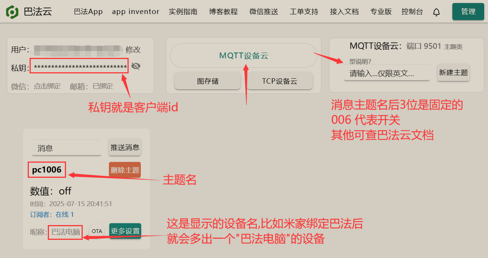
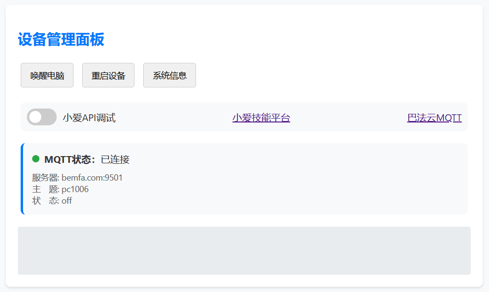

# 让语音助手开电脑
前提：需要一台长期开机的设备（比如路由器）  
方式有下面两种

### 1. 小米小爱开放平台
此平台已不让注册，已注册的可用，还必须有公网  
[创建小爱技能](https://developers.xiaoai.mi.com/skill/create/index)  
配置文件中 `xiaoai_key` 填你生成的技能的 `key_id`

### 2. 巴法云平台
此平台是注册最简单的平台，可用邮箱注册，因为用MQTT，所以不需要公网  
此平台支持4种家居平台：小爱、小度、Google、亚马逊  
在米家添加第三方设备找`巴法`，其他语音助手类似。  
[巴法云](https://cloud.bemfa.com/web/user/index)  
[巴法云文档](https://cloud.bemfa.com/docs/#/)

需要在配置文件中填写:  
`client_id` 你的巴法云私钥  
`topic` 消息主题  
服务器地址和端口默认就行



### 配置文件
```json
{
    "port": 3030,
    "mac": "00-00-00-FF-FF-FF",
    "xiaoai_key": "xiaoaikey",
    "mqtt": {
        "client_id": "bemfa_private",
        "topic": "title",
        "server": "bemfa.com",
        "port": 9501
    }
}
```
`port` web服务端口  
`mac` 要开机的电脑 mac 地址

### 用法
执行程序和配置文件放同一目录

windows直接运行  
```
xiaoai-wol-amd64.exe
```

linux进入程序目录先给执行权限
```
chmod +x xiaoai-wol-amd64
```
试运行检查可看日志，`ctrl+c`中止
```
./xiaoai-wol-amd64
```
测试好后把程序放后台运行
```
./xiaoai-wol-amd64 &
```
有的需要加 nohup
```
nohup ./xiaoai-wol-amd64 &
```
想开机启动就把命令加启动脚本里

运行后打开 `http://ip:端口` 就能看到界面（这个就测试时用下，平常用不到界面）



`唤醒电脑` 是手动发送唤醒命令  
`重启设备` 是重启此程序所在设备（比如路由器）  
`系统信息` 是此程序所在设备的信息  
`小爱调试` 打开后会显示小爱服务器发来的消息，但不执行  
`MQTT` 中的 `状态` 有 `on` 和 `off`，收到 `on` 会唤醒电脑并在 5秒 后发送 `off` 还原开关状态